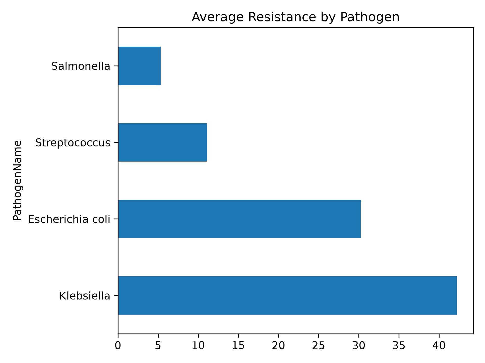
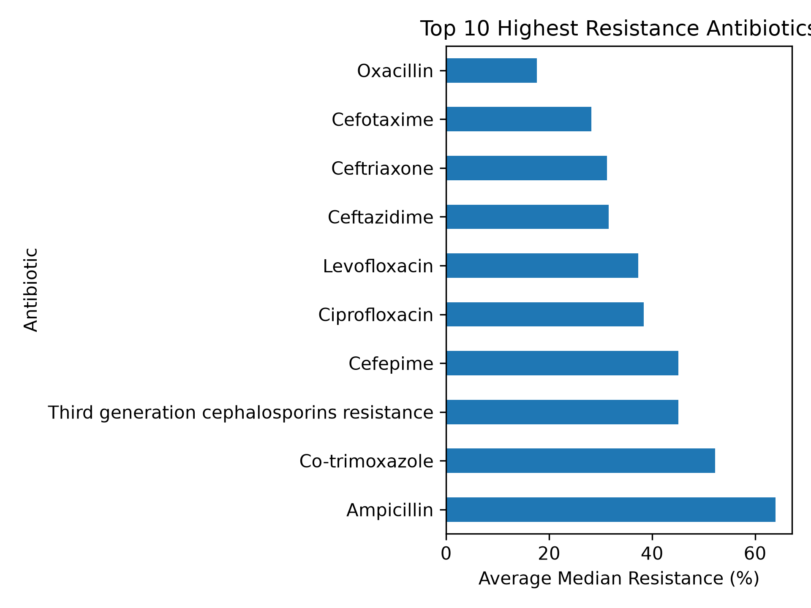
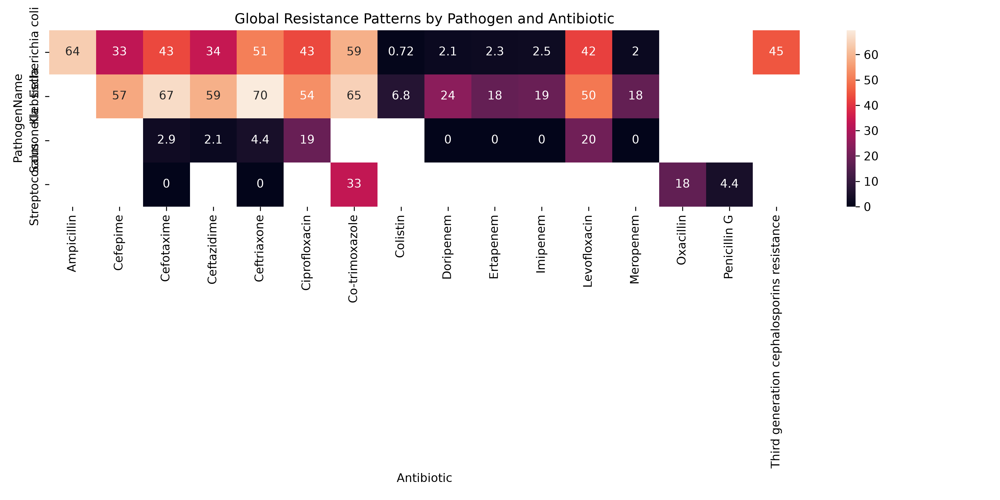
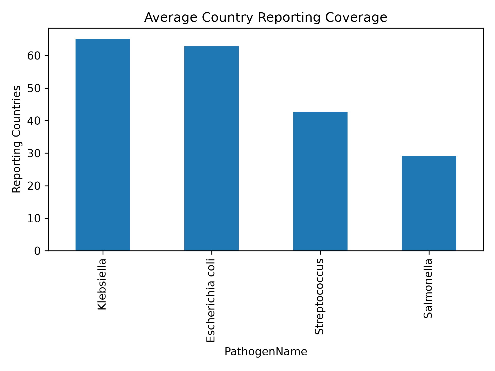

# Global Antimicrobial Resistance Trends in Priority Bacterial Pathogens using WHO GLASS 2023 Surveillance Data

A WHO GLASS-based antimicrobial resistance surveillance project analyzing global resistance patterns among clinically important bloodstream pathogens.

## Project Overview

Antimicrobial resistance (AMR) is one of the greatest threats to global health.

This project analyzes WHO GLASS 2023 surveillance data for:

- Escherichia coli
- Klebsiella spp.
- Salmonella spp.
- Streptococcus pneumoniae

The objective is to explore global resistance trends, identify highly resistant pathogens, and evaluate antibiotic effectiveness using reproducible Python workflows.

---

## Research Questions

1. Which pathogen demonstrates the highest resistance burden?

2. Which antibiotics show the highest resistance globally?

3. How do resistance patterns differ across pathogens?

4. How extensive is global surveillance coverage?

---

## Data Source

World Health Organization (WHO)

Global Antimicrobial Resistance and Use Surveillance System (GLASS)

2023 Surveillance Data

---

## Methods

- Data extraction from WHO GLASS
- Data cleaning using Pandas
- Exploratory Data Analysis (EDA)
- Statistical summarization
- Scientific visualization using Matplotlib and Seaborn

---

## Key Findings

- Klebsiella showed the highest resistance burden.
- Ampicillin exhibited the highest median resistance.
- Carbapenems generally retained stronger effectiveness.
- Resistance patterns varied significantly across pathogens.

---

## Technologies Used

- Python
- Pandas
- Matplotlib
- Seaborn
- Jupyter Notebook
- Git
- GitHub

---

## Figures

### Average Resistance by Pathogen

### Top Resistant Antibiotics

### Resistance Heatmap

### Reporting Coverage

